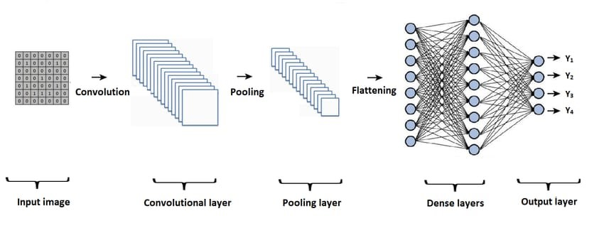
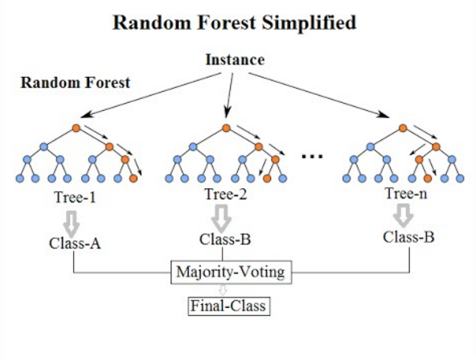
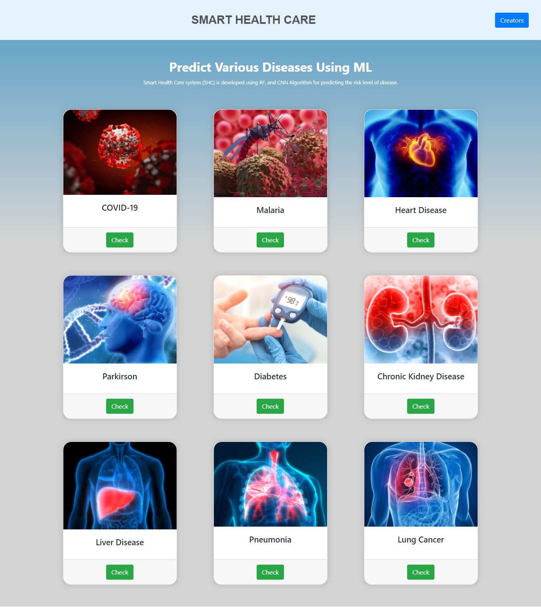
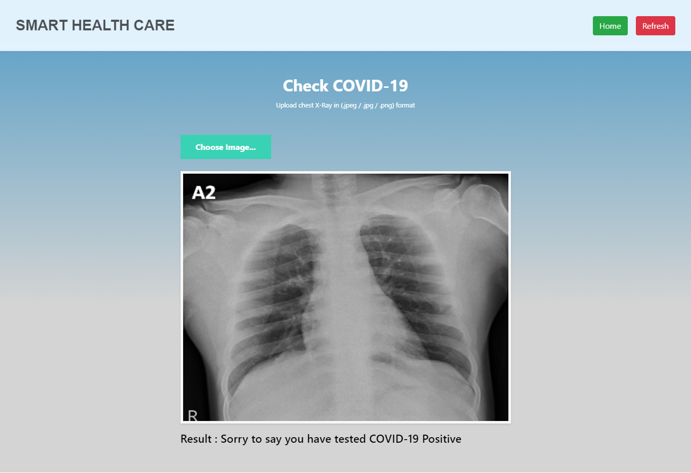
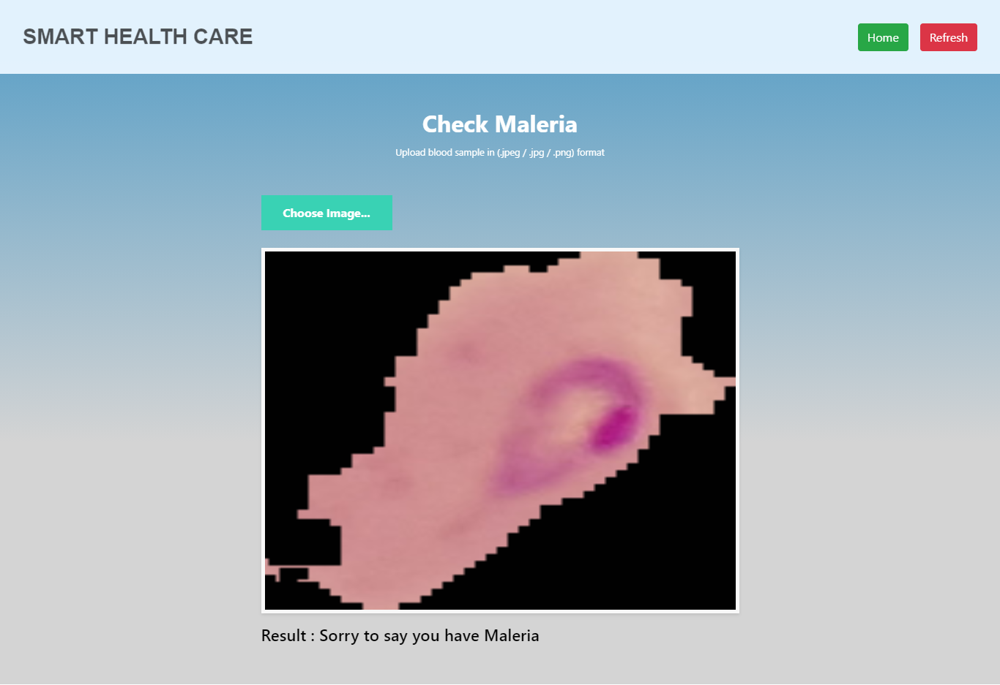
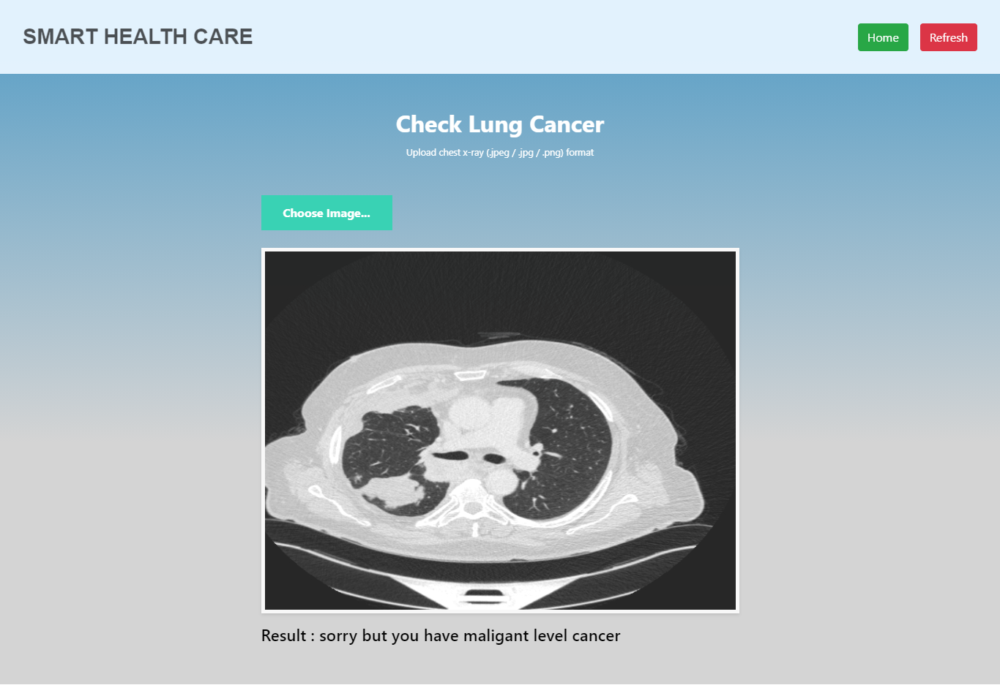
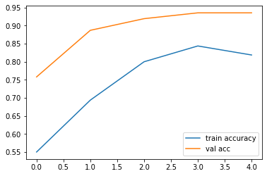
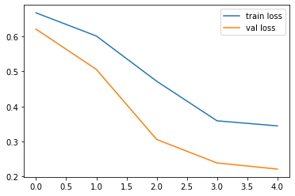

# **Smart-Health-Care**

**Table of Contents :**

- Introduction
- Prerequisites
- Data collection
- Model Architecture
- Snapshots
- Conclusion and Future work
- Creators

**1. Introduction :**

Smart Health Care is a website that predicts the disease of the user with respect to the symptoms given by the user. The Smart Health Care system has data sets collected from different health related sites. With the help of Smart Health Care the user will be able to know the probability of the disease with the given symptoms. This project will help to predict 9 different types of disease such as Liver, Kidney, Heart, Parkinson, Covid-19, Malaria, Diabetes , Pneumonia and Lung Cancer  on a single platform.

**2. Prerequisites :**

This post assumes familiarity with basic Deep Learning concepts like Multi-layered Perceptron, Gradient Descent, Backpropagation, Overfitting, Probability, Python syntax and data structures, Tensorflow library, etc and Machine learning concepts like Preprocessing Techniques,Exploratory Data Analysis, Handling Imbalanced Data Techniques , HyperParameter Tuning Techniques etc.

Algorithms :-  Convolution Neural Networks, RandomForest Classification.

Front end :-knowledge of HTML CSS JS Booststrap

Backend :- Python programing and Flask.

**3. Data Collection :**

These are the links where you can find the datasets

- [Heart](https://www.kaggle.com/johnsmith88/heart-disease-dataset)
- [Liver](https://www.kaggle.com/uciml/indian-liver-patient-records)
- [Kidney](https://www.kaggle.com/mansoordaku/ckdisease)
- [Diabetes](https://www.kaggle.com/uciml/pima-indians-diabetes-database)
- [Maleria](https://www.kaggle.com/iarunava/cell-images-for-detecting-malaria)
- [Pneumonia](https://www.kaggle.com/paultimothymooney/chest-xray-pneumonia)
- [Parkinsons](https://www.kaggle.com/nidaguler/parkinsons-data-set)
- [Covid](https://www.kaggle.com/allen-institute-for-ai/CORD-19-research-challenge)
- [Lung Cancer](https://data.mendeley.com/datasets/bhmdr45bh2/1)

**4. Model and System Architecture :**

These is the System Architecture in the way the work flow of program will run.

**What is CNN?**

A Convolutional Neural Network (ConvNet/CNN) is a Deep Learning algorithm which can take in an input image, assign importance (learnable weights and biases) to various aspects/objects in the image and be able to differentiate one from the other. The pre-processing required in a ConvNet is much lower as compared to other classification algorithms. While in primitive methods filters are hand-engineered, with enough training, ConvNets have the ability to learn these filters/characteristics.

The architecture of a ConvNet is analogous to that of the connectivity pattern of Neurons in the Human Brain and was inspired by the organization of the Visual Cortex. Individual neurons respond to stimuli only in a restricted region of the visual field known as the Receptive Field. A collection of such fields overlap to cover the entire visual area.

In this project, CNN algorithm is used to analyze the medical case diagnosis of Malaria, Covid 19, Lung cancer and Pneumonia.

**RandomForest Classifier**

This algorithm is an improvement of the decision tree algorithm. It is mainly used to build predictive model for both classification and regression problems. It generates decision trees which grow randomly in selected subspaces. The main idea is to generate small decision tress in random subsets of data, where each decision tree has different data trends and a biased classifier. Each tree is formed in random with input variables which are used to split. Then, the best split is calculated based on the training set features. General methods use multiple learning models but in random forest, it creates a model for entire forest to arrive the best solution. In this project, the random forest algorithm is used to analyze the medical case diagnosis of breast cancer. The random forest algorithm can combine the characteristics of multiple eigenvalues, and the combined results of multiple decision trees can be used to improve the prediction accuracy.

**5. Snapshots :**

** Accuracy and Loss **

**6. Conclusion and Future work :**

The main goal of this Project is to use ML for disease diagnosis and, thus, the competence of ML in improving the diagnosis of disease. This project aims to predict the disease on the basis of the symptoms. The project is designed in such a way that the system takes symptoms from the user as input and produces output i.e. predict disease. The focus is on using different algorithms and consolidation of certain target attributes to predict different disease like Heart disease, corona, malaria, diabetes effectively using machine learning and neural network. Average prediction accuracy probability of 88% is obtained. In this paper, the issue of current medical diagnosis system and used for the medical prediction is explained. This project will be further increased developed for the automation of the many different disease prediction more accurately.

### 7. Creators :

[Mahesh Dhoran](https://www.linkedin.com/in/maheshdhoran/)

[Pratish Varma](https://www.linkedin.com/in/pratish-varma-a72306197/)

[Raj Sutane](https://www.linkedin.com/in/raj-sutane-4379231ab/)
 
[Harshal Chambare](https://www.linkedin.com/in/harshal-chambhare-999048209/)

[Samiksha Bhange](https://www.linkedin.com/in/samiksha-bhange-2750751a8/)

[Madhurika Belsare](https://www.linkedin.com/in/madhurika-belsare-9a144b117/)

